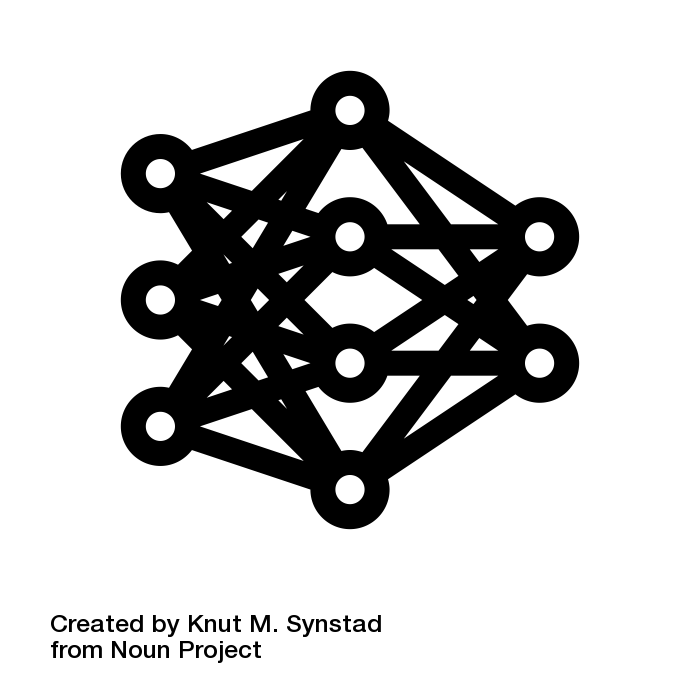

## Neural network

### Problem

There are one thousand and one supervised learning algorithms. **Is there one universal (not necessarily optimal in all cases) algorithm to build model for supervised learning?**

### Solution

{ width=20% }

Neural network is set of objects and functions combined as one model, designed to solve one type of task, usually formulated as supervised learning problem. It is loosely inspired by brain structure, hence the *neural* part in its name. It has network stricture because it is build upon single functional entities called neurons.

Each neural network consist following elements:
 * layers of neurons
 * activation functions for each layers
 * weights for connections between neurons

Neuron is smallest building element in neural network. In general it consist following elements: inputs, bias, weighted sum, activation function and output. Its task is simple - receive input values, put them (with weights) into weighted sum, put the result as input into activation function and sent the results to next layer (if there is any).

When neurons layer is defined, there are two parameters for consideration - number of neurons and activation function. Optimal number of neurons in layer might be easily determined by iterations of test. Each activation function on the other hand is slightly different and it might be worthy to get familiar with them in order so avoid time wasting and some unexpected behavior.

Some of most interesting activation functions:

#### Perceptron

Oldest activation function used in neural networks. It outputs value 1 if input is positive, and outputs 0 if input is negative. $$ f(x) = \begin{cases}1 & \text{if }\ w \cdot x + b > 0\\0 & \text{otherwise}\end{cases} $$ 
where *w* is a vector of real-valued weights, $w \cdot x$ is the $\sum_{i=1}^m w_i x_i$, where *m* is the number of inputs to the perceptron and *b* is the bias.
 
#### Sigmoid 

#### Hyperbolic tangent

#### Rectifier 

### ELI5

Neural network is a machine learning model which is supposed to give sane results for all type of problems, but it might require lots of data to train and some work in picking good hyperparameters.

### Best practices

 * Although you can code your own neural network from scratch (Python and Numpy example [here](https://github.com/llSourcell/Make_a_neural_network/blob/master/demo.py)) it is recommended to use one of common open source neural network libraries - either for R or Python. 

### Related

Keras, convnet, tensorflow, backpropagation
