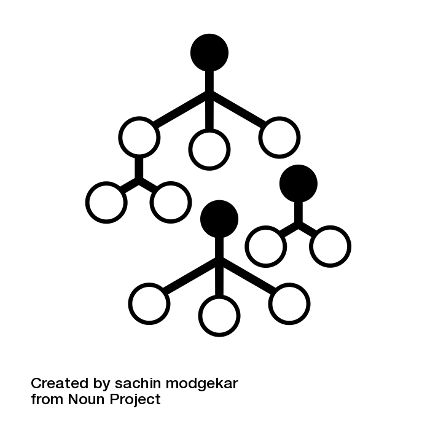

## Random forest

### Problem

I like decision trees but I'm afraid they overfit easily and give not quite good results. **Is there way to improve decision tree?**

### Solution

{ width=20% }

Random forest is an algorithm based on decision trees. Generally it works in the same way as decision tree, but instead of training one decision tree optimized by criterion, it trains number of trees. But there are two significant differences. One is that you can use bootstrap to build new training set for every tree. Second difference is that you are not using all features for training tree, but subset of them. Thanks to this, after training the model, we have number (a forest) of different (trained on random subset) trees, which are voting for final output. In classification problem we will pick mode and in regression problem we will pick average.

Single decision tree has higher variance the deeper it is. Creating ensemble of trees reduces variance, so it has better generalization property and smaller sensitivity to noise.

Since we are training lots of trees and using them as an ensemble, we can't easily interpret created structure, which was main advantage of single decision tree.

Three most important parameters for consideration while building random forest:
* number of trees in forest - how much decision trees will be trained. The higher the number, the variance will be smaller. But training time will be longer. Good starting value would be 100. Default value in scikit-learn is 10 and in randomForest is 500. Highest possible number should be used.
* number of maximum features - number of randomly selected features considered for each split. For testing it might be worth to try values from 0.05 (5%) to 1 (100%) in 0.05 step. Default value in scikit-learn is sqrt(n-features) for classifier and n-features for regressor. In R randomForest default values are sqrt(n-features) for classification and n-features/3 for regression.
* bootstrap - this will enable training set generation for each tree via sampling with replacement. If set to false, full training set will be used. In scikit-learn and in randomForest default set to true.  

If we are using bootstrap and number of maximum features < 1 then we are practically training each decision tree on different data set. In this case, we could grow fully developed trees (without for eg. deepth or min samples restrictions) without worrying too much about overfitting. Single trees would probably overfit a lot, but working as an ensemble their summarical variance is lower.

While using bootstrap, some of train observations would not be selected into training particular tree. Thoose observations are called out-of-bag observations. They can be automatically used to determine quality of trained model - there will be no need to perform additional cross validation procedure.

One particularly interesting fact is how feature importance is calculated. It is called "mean decrease impurity" and is calculated based on error reduction in each node weighted by number of samples entering that node and averaged over all trees. If the error reduction with particular feature is great and is performed on many samples it points to valuable feature and if the error reduction is poor or is performed usually on small number of samples it will give unimportant feature.

### ELI5

We can train lots of decision trees on subsets of data and use them to vote on final result.

### Best practices

* Scikit-learn has random forest implementation for classification and regression. Despite good default values for parameters, you should consider adjusting some of them: *n_estimators*, *criterion*, *max_features*, *min_samples_split*, *min_samples_leaf*, *bootstrap*.
* R programming language also has implementation of random forest - randomForest.
* Since there are random features in each split, you can add features to you input which you are note certain that are meaningful. It should not hurt overall model output.
* Training time for random forest will increase with number of trees in it. It will scale more or less linearly so you can easily estimate total training time with training smaller forest initially.
* Since instances and features selection is independent, trees for random forest can be built independent. If your software supports parallel building of the random forest you should probably use it.
* Random forest is a black-box model, but you can get feature importance from trained model and examine each decision tree individually. This might give you better intuition about it.
* Random forest can be trained on subset of data. And because we are training individual trees, we can apply this algorithm on distributed big data systems which will build trees on particular machines. This gives pretty convenient way of utilizing redundant and distributed data infrastructure.

### Related

Machine learning, scikit-learn, python, decision trees
